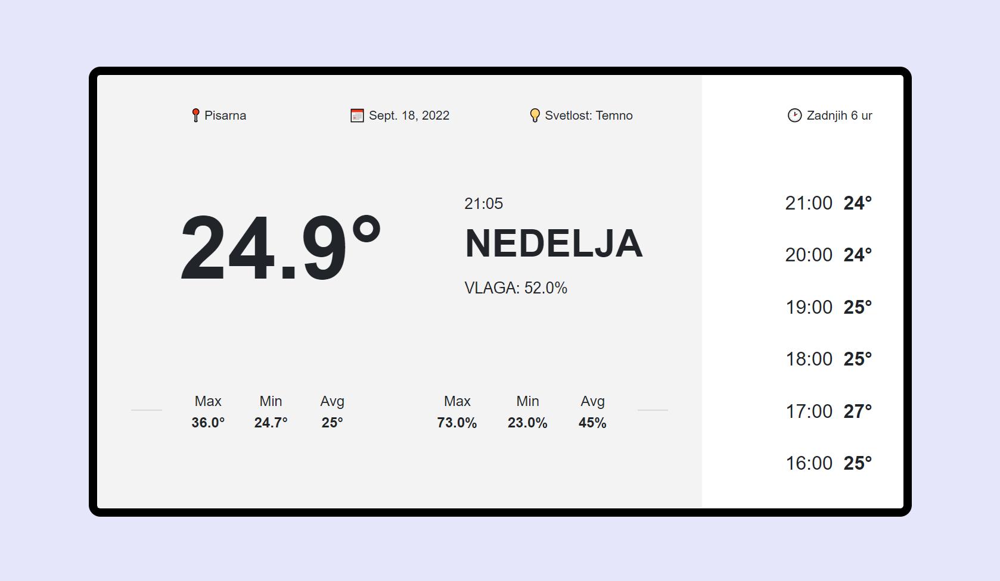
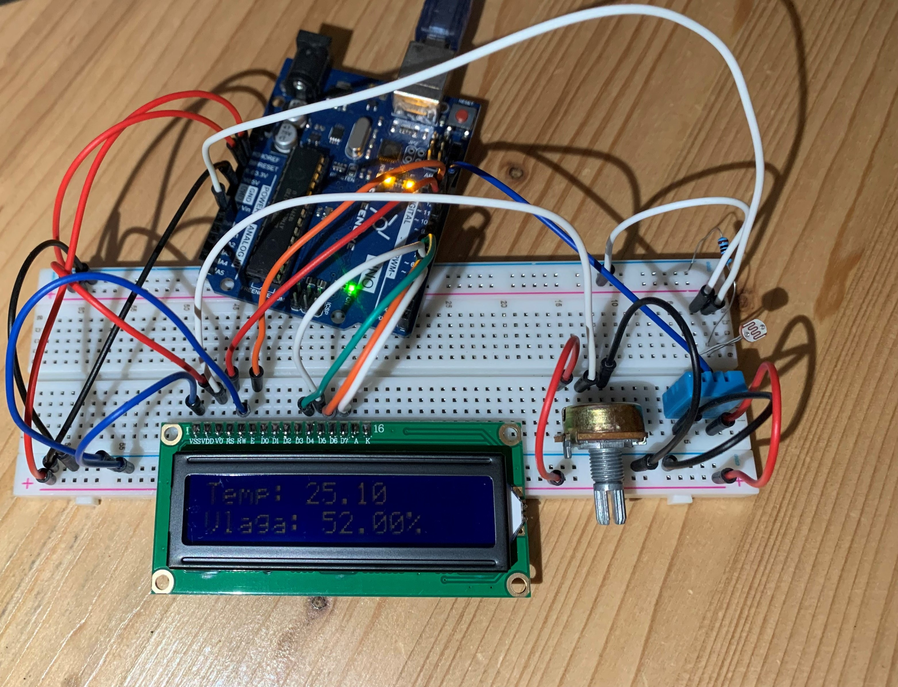

# PROJEKT VIN: HOME MONITORING SYSTEM

Vse datoteke za projekt se nahajajo na [GitHub](https://github.com).

### Na arduinotu lahko spremnljamo temperaturo in vlago na ekranu, posodablja se na 10 sekund. Lahko pa tudi preko spletne aplikacije spremljamo te parametre. Na spletni aplikaciji so tudi drugi parametri, naprimer svetlost, največja, najmanjša in povprečna temperatura in vlaga ter zgodovina temperature za zadnjih 6 ur. 

# Spletna Aplikacija


# Arduino


# How To:

## Potrebne komponente:
    - Arduino
    - DHT11 senzor za toploto in vlago
    - Razvojna plošča
    - Senzor za svetlobo
    - Potenciometer
    - Upor 10k ohm

## Sestavljanje vezja

### Priprava plošče
 * Ozemljitev priklučimo na obe liniji za ozemljitev označeni z -
 * 5v iz arduinota priključimo na zgornjo linijo označeno z +
 * 3.3v iz arduinota priključimo na spodnjo linijo označeno z +


### Senzor DHT11 za temperaturo in vlago

(Potrebno je namestiti knjižnice za pravilno delovanje)

 * VCC priklopimo na 3.3v
 * GND priklopimo na ozemljitev
 * Data priklopimo na pin 12
 * Pin NC naj ostane prazen

### Senzor za svetlobo


 * Povežemo ga tako kot prikazuje zgornja slika
 * Rdeča žica oziroma VCC mora biti priklopljena na 5v
 * Rumena žica mora biti povezana z analognim pinom A0, po tej žici bomo prejeli podatke
 * Črna žica mora biti povezana na GND

### Display


 * LCD RS pin na digital pin 10
 * LCD Enable pin na digital pin 11
 * LCD D4 pin na digital pin 5
 * LCD D5 pin na digital pin 4
 * LCD D6 pin na digital pin 3
 * LCD D7 pin na digital pin 2
 * LCD R/W pin na ground
 * LCD VSS pin na ground
 * LCD VDD pin na 5V
 * Potenciometer:
    * Robne žice na 5V in GND
    * Sredinjsko žico na LCD VO pin (pin 3)


### Programiranje Arduino

Koda za arduino je navoljo na github

Razlaga programa:

Pripravimo display za uporabo in definiramo vse njegove pine:

```
const int rs = 10, en = 11, d4 = 5, d5 = 4, d6 = 3, d7 = 2;
LiquidCrystal lcd(rs, en, d4, d5, d6, d7);
```

Inicializiramo spremenjlivke za temperaturo, vlago in svetlost
```
int svetlost = analogRead(A0);
float vlaga;
float temperatura;
```

Zaženemo serisko konzolo s hitrostjo 9600 baud, pripravimo lcd display in dht senzor za uporabo:
```
void setup() {
  Serial.begin(9600);
  dht.begin();
  lcd.begin(16, 2);
}
```

Glavna zanka, ki se izavja v neskončnost:
```
void loop() {
```
* Prebere se svetloba, vlaga in temperatura:
    ```
    svetlost = analogRead(A0);
    vlaga = dht.readHumidity();
    temperatura = dht.readTemperature();
    ```
 * Preveri, če sta temperatura in vlaga vnešeni:
    ```
    if (isnan(vlaga) || isnan(temperatura)) {
        Serial.println("Napaka");
        return;
    }
    ```
 * Izpiše vse podatke na serijski vmesnik, kjer jih bo kasneje druga aplikacija prebrala in vpisala v sql strežnik:
    ```
    Serial.print(temperatura);
    Serial.print("&");
    Serial.print(vlaga);
    Serial.print("&");
    Serial.print(svetlost);
    Serial.println();
    ```

 * Zapiše podatke na led ekran:
    ```
    lcd.setCursor(0, 0);
    lcd.print("Temp: " + String(temperatura));
    lcd.setCursor(0, 1);
    lcd.print("Vlaga: " + String(vlaga) + "%");
    ```

 * Počaka sekundo in nadaljuje
    ```
    delay(1000);
    }
    ```

### Programiranje sprejemnika

Sprejemnik dobi podatke iz serijskega vmesnika in jih zapiše v sql bazo. Baza teče na lokalnem strežniku.

Razlaga kode:
 * Povezava z bazo:
    ```
    db = mysql.connector.connect(
    host="localhost",
    user="root",
    password="",
    database="arduino"
    )

    cursor = db.cursor()
    ```
 * Neskončna zanka, ki prebere podatke iz serijskega vmesnika in jih zapiše v sql bazo.
    ```
        while True:
            data = serial.Serial(port='COM5', baudrate=9600).readline()
            data = str(data).strip()

            temp, hum, light = data.split("&")

            temp = temp[2:-1]
            hum = hum.split('.')[0]
            light = light[:-5]

            test = serial.Serial(port='COM5', baudrate=9600).readline()

            sql = "INSERT INTO data (time, temp, hum, light) VALUES (%s, %s, %s, %s)"
            val = (str(int(time.time())), temp, hum, light)
            cursor.execute(sql, val)
            db.commit()
            print(data)
            print(test)
            print(temp, hum, light)
            time.sleep(10)
    ```

### Programiranje strežnika
Vsa koda za strežnik je na GitHub.
[Vir za izgled](https://bbbootstrap.com/snippets/full-screen/bootstrap-weather-report-different-day-and-time-temperature-86813775)   
Strežnik servira spletno stran. Podatke pridobi iz sql strežnika.   
   
Strežnik se zažene z ukazom (Postavljeni moramo biti v servermonitor mapi, kjer se nahaja manage.py):
```
py manage.py runserver 0.0.0.0:8000
```
#### Pomembne metode:
 * monitor: ko prileti zahteva jo sprejme in sestavi odgovor s pomočjo podatkov iz baze in drugih funkcij
    ```
    def monitor(request):
        template = loader.get_template('index.html')
        cas = datetime.now()
        locale.setlocale(locale.LC_TIME, "sl_SE")
        podatki = database_data()
        temp = [i[1] for i in podatki]
        hum = [i[2] for i in podatki]
        light = [i[3] for i in podatki]

        context = {
            'datum': date.today(),
            'vlaga': hum[0],
            'temperatura': temp[0],
            'dan': cas.strftime("%A").upper(),
            'ura': cas.strftime("%H:%M"),
            'svetlost': svetlost(light[0]),
            'avg_hum': int(sum(hum) / len(hum)),
            'max_hum': max(hum),
            'min_hum': min(hum),
            'avg_temp': int(sum(temp) / len(temp)),
            'max_temp': max(temp),
            'min_temp': min(temp),
            'podatki': get_nazaj(podatki),
        }

        
        return HttpResponse(template.render(context, request))
    ```
 * database_data: prebere podatke za 6 ur nazaj iz sql baze (podatek pride vsakih 10 sekund kar pomeni 360 na uro ter 2160 na 6 ur)
    ```
    def database_data():
        db = mysql.connector.connect(
        host="localhost",
        user="root",
        password="",
        database="arduino"
        )

        cursor = db.cursor()
        cursor.execute("SELECT time, temp, hum, light FROM data ORDER BY time DESC LIMIT 2200;")
        podatki = cursor.fetchall()

        db.close()

        return podatki
    ```
 * get_nazaj: pridobi povprečje za vsako uro za 6 ur nazaj:
    ```
    def get_nazaj(podatki):
        ura = math.floor((int(time.time()) % 86400) /3600)
        podatki = [(math.floor((i[0] % 86400) /3600), i[1]) for i in podatki]
        now = int(time.time())

        rezultat = ["?"] *6
        for r in range(6):
            temp = [i[1] for i in podatki if i[0] == ura - r]
            rezultat[r] =  (ura + 2 - r) , ("??" if len(temp) == 0 else math.floor( sum(temp) / len(temp) ))
            
        print(rezultat)
        return rezultat
    ```
 * Svetlost: pretvori lumne v besedo (saj je senzor nenatančen):
    ```
    def svetlost(light):
        if (light < 10):
            return "Noč"
        elif (light < 200):
            return "Temno"
        elif (light < 500):
            return "Normalno"
        elif (light < 800):
            return "Svetlo"
        else:
            return "Zelo svetlo"
    ```